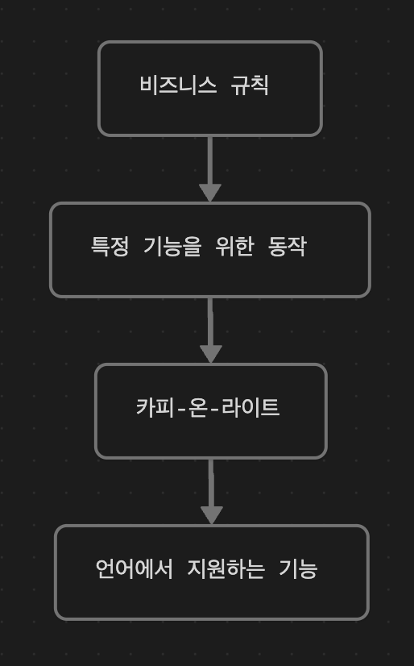

### 소프트웨어 설계

> 코드를 만들고, 테스트하고, 유지보수하기 쉬운 프로그래밍 방법을 선택하기 위해 미적 감각을 사용하는 것.

### 계층형 설계

> 소프트웨어를 계층(layer)으로 구성하는 기술

### 각 계층의 목적

### 계층형 설계를 위한 단서들

- **함수 본문**
	- 길이
	- 복잡성
	- 구체화 단계
	- 함수 호출
	- 프로그래밍 언어의 기능 사용
- **계층 구조**
	- 화살표 길이
	- 응집도
	- 구체화 단계
- **함수 시그니처**
	- 함수명
	- 인자 이름
	- 인잣값
	- 리턴값

### 계층형 설계의 과정

- **조직화**
	- 새로운 함수를 어디에 놓을지 결정
	- 함수를 다른 곳으로 이동
- **구현**
	- 구현 바꾸기
	- 함수 추출하기
	- 데이터 구조 바꾸기
- **변경**
	- 새 코드를 작성할 곳 선택하기
	- 적절한 수준의 구체화 단계 결정하기