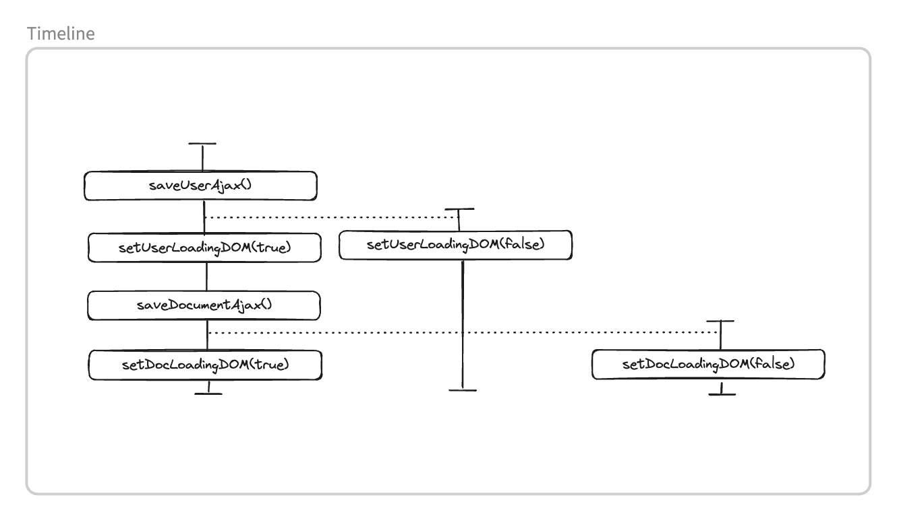
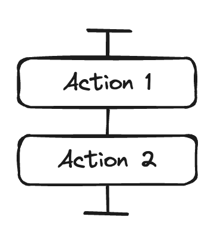
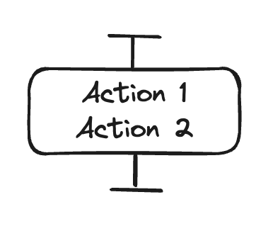

### 3 Steps for timeline diagram

1. 액션을 확인한다.
2. 각 액션을 그린다.
3. 단순화한다.


### 예시

```javascript
saveUserAjax(user, function() {
	 setUserLoadingDOM(false);
});
setUserLoadingDOM(true);
saveDocumentAjax(document, function() {
	setDocLoadingDOM(false);
});
setDocLoadingDOM(true);
```

`setUserLoadingDOM(false)` 는 콜백 안에 있다. 콜백은 비동기로 실행되기 때문에 요청이 끝나는 시점에 언젠가 실행된다.
비동기 콜백이기 때문에 새로운 타임라인이 필요하다.
그리고 콜백이 ajax 함수 뒤에 실행된다는 사실을 점선으로 표시한다.
요청을 보내기 전에 응답을 받을 수는 없기 때문에 점선으로 순서를 표시해야 한다.

`setUserLoadingDOM(true)` 는 콜백이 아니므로 원래 타임라인에서 실행된다.

`saveDocumentAjax()` 는 콜백 밖에 있으므로 원래 타임라인에서 실행된다.

`setDocLoadingDOM(false)` 는 콜백 안에 있는 코드이기 때문에 새로운 타임라인에 그린다.
이 콜백은 미래에 응답이 도착하는 시점에 실행된다.
네트워크 상황을 예측할 수 없어서 언제 실행될지 알 수 없다.

`setDocLoadingDOM(true)` 는 콜백 밖에 있으므로 원래 타임라인에서 실행된다.



### 코드 실행 순서

코드는 두 가지 형태로 실행될 수 있다.
일반적으로 순서대로 실행되는 두 액션 사이에 다른 타임라인에 있는 액션이 끼어들 수 있다.
하지만 어떤 환경에서는 그렇지 않다.
예를 들어, 자바스크립트 스레드 모델에서 동기화된 액션 사이에는 다른 액션이 끼어들 수 없다.

#### 순서가 섞일 수 있는 코드

두 액션 사이에 시간은 얼마나 걸릴지 알 수 없다.
액션은 박스로 표시하고 액션 사이에 걸리는 시간은 선으로 표시한다.
그래서 액션과 액션 사이에 걸리는 시간에 따라 선을 길게 그릴 수도 있고 짧게 그릴 수도 있다.



#### 순서가 섞이지 않는 코드

어떤 경우에는 두 액션이 차례로 실행되는데 그 사이에 다른 작업이 끼어들지 못한다.
런타임이 원래 해주거나 프로그래밍을 통해 그렇게 만들 수 있다.
이 경우에는 액션을 같은 상자에 그린다.

