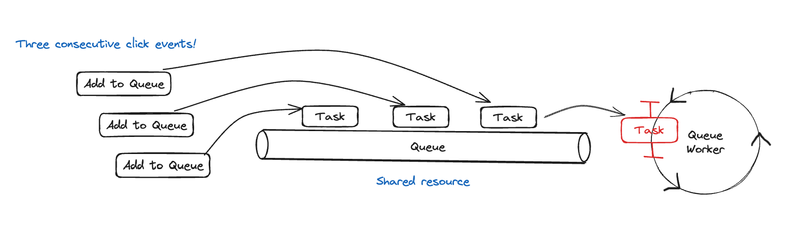
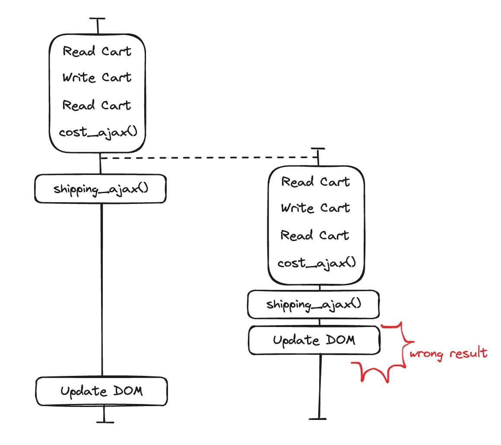
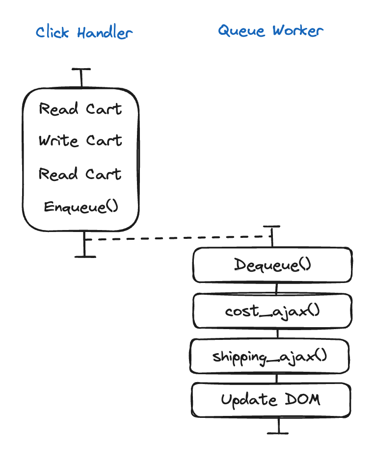

## 동시성 기본형(Concurrency Primitive)

**동시성 기본형**은 자원을 안전하게 공유할 수 있는 재사용 가능한 코드를 말한다.
이는 큐(Queue) 자료형을 의미하는데, 타임라인 조율을 위해 사용하는 큐는 동시성 기본형이라고 부른다.

큐는 공유 자원이지만 안전하게 공유된다.
순서대로 작업을 꺼내 쓸 수 있기 때문이다.
그리고 큐에 있는 모든 작업은 같은 타임라인에서 처리되기 때문에 순서가 관리된다는 장점이 있다.

## 예시

아래는 의도하지 않은 결과가 도출될 수 있는 위험한 타임라인이다.
왼쪽의 액션이 먼저 실행되었지만, 오른쪽 Update DOM 액션이 먼저 일어났기 때문이다.

큐(Queue) 자료형을 동시성 기본형으로 사용하여 아래와 같은 타임라인을 만들 수 있다.

가능한 많은 작업을 클릭 핸들러에서 수행하는 것이 좋다.
클릭 핸들러에는 다른 작업이 끼어들 수 없어서 순서가 섞일 염려가 없기 때문이다.
`cost_ajax()` 는 비동기 호출이기 때문에 다음에 순서가 끼어들 수 있는 첫 번째 액션이다.
따라서 가능하다면 `cost_ajax()` 전에 작업하는 것이 좋다.
