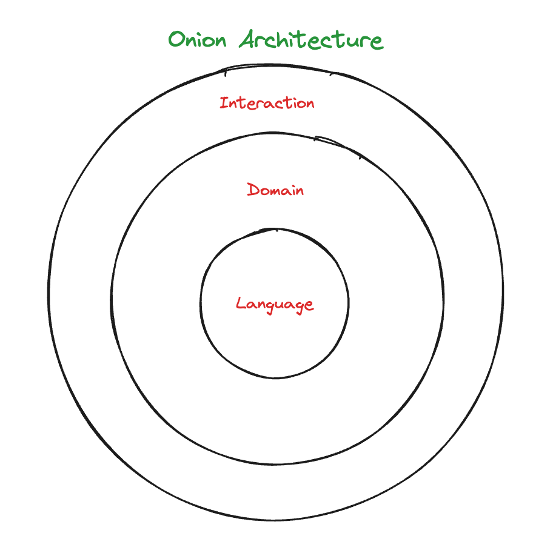
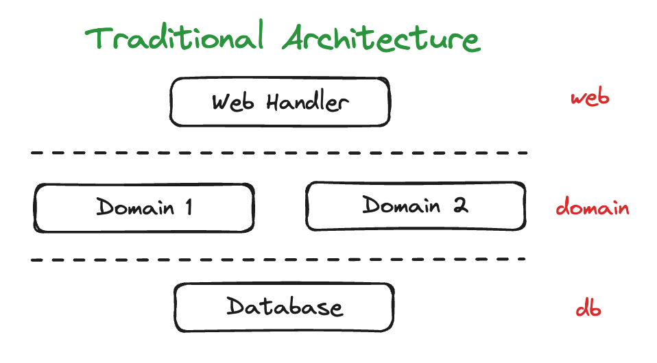
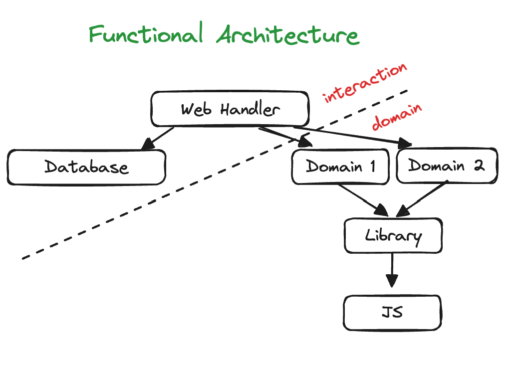

## 어니언 아키텍처

어니언 아키텍처는 반응형 아키텍처보다 더 넓은 범위에 사용된다.
어니언 아키텍처는 서비스 전체를 구성하는 데 사용하기 때문에 바깥 세계와 상호작용을 하는 부분을 다룬다.
반응형 아키텍처와 함께 사용하면 반응형 아키텍처가 어니언 아키텍처 안에 들어 있게 되지만, 서로 의존하지는 않는다.

- Interaction Layer : 바깥세상에 영향을 주거나 받는 액션
- Domain Layer : 비즈니스 규칙을 정의하는 계산
- Language Layer : 언어 유틸리티와 라이브러리

어니언 아키텍처는 특정 계층이 꼭 필요하다고 강제하지 않는다.
하지만 많은 경우에 위와 같이 3가지 큰 분류로 나눌 수 있다.
위 그림으로 함수형 시스템이 잘 동작할 수 있는 중요한 규칙을 알 수 있다.

1. 현실 세계와 상호작용은 인터랙션 계층에서 해야 한다.
2. 계층에서 호출하는 방향은 중심 방향이다.
3. 계층은 외부에 어떤 계층이 있는지 모른다.

## 전통적인 계층형 아키텍처

전통적인 아키텍처로 웹 API 를 만들 때 계층(Layer) 이라고 하는 개념을 사용한다.
하지만 어니언 아키텍처의 계층과는 다르다.

- Web Interface Layer : 웹 요청을 도메인으로 바꾸고 도메인을 웹 응답으로 바꾼다.
- Domain Layer : 애플리케이션 핵심 로직으로 도메인 개념에 DB 쿼리나 명령이 들어간다.
- Database Layer : 시간에 따라 바뀌는 정보를 저장한다.

**전통적인 계층형 아키텍처**는 **데이터베이스를 기반**으로 한다.
도메인 계층은 데이터베이스 동작으로 만든다. 그리고 웹 인터페이스 계층은 웹 요청을 도메인 동작으로 변환한다.

사실 데이터베이스 계층이 가장 아래 있다면, 그 위에 있는 모든 것이 액션이 되기 때문에 전통적인 계층형 아키텍처는 함수형 스타일이 아니다.
모든 것이 계층에 쌓여있고 계산은 따로 관리되지 않고 우연히 사용된다.
함수형 아키텍처는 계산과 액션에 대한 명확한 규칙이 있어야 한다.

## 전통적인 계층형 아키텍처 vs 함수형 아키텍처

전통적인 아키텍처와 함수형 아키텍처를 비교하였을 때 가장 눈에 띄는 점은 데이터베이스 계층과 도메인 계층의 관계이다.
**함수형 아키텍처**는 **도메인 계층이 데이터베이스 계층에 의존하지 않는다.**

데이터베이스 동작은 값을 바꾸거나 데이터베이스에 접근하기 때문에 액션이다.
즉, 데이터베이스는 변경 가능하고 접근하는 모든 것을 액션으로 만든다는 것이 핵심이다.
그래서 도메인 동작을 포함해 그래프의 가장 위에 있는 것까지 모두 액션이 된다.

하지만 함수형 개발자는 액션과 계산을 명확하게 구분하려고 하고 도메인 로직은 모두 계산으로 만들어야 한다고 생각한다.
따라서 데이터베이스를 도메인과 분리하는 것이 중요하다.
가장 위에 있는 액션에서 도메인 규칙과 데이터베이스를 조합하는 것이다.

위 함수형 아키텍처 그림에서 각 점선 끝을 연결하면, 어니언 아키텍처와 같은 모양이 된다.

## 어니언 아키텍처의 변경과 재사용

어떤 의미에서 소프트웨어 아키텍처는 변화를 다루는 일이다.
과연 어니언 아키텍처에서는 어떤 것을 바꾸기 쉬울까?

어니언 아키텍처에서는 Interaction Layer 를 바꾸기 가장 쉽다.
가장 위에 위치하고 있기 때문이다.
도메인이 데이터베이스나 웹 요청에 의존하지 않기 때문에 Interaction Layer 에 속하는 데이터베이스나 서비스 프로토콜은 쉽게 바꿀 수 있다.
그리고 도메인 계층도 데이터베이스나 서비스 같은 것을 사용하지 않으므로 전부 계산으로 만들 수 있다.

정리하면, 어니언 아키텍처는 데이터베이스나 API 호출과 같은 외부 서비스를 변경하기 쉽다.
가장 높은 계층에서 사용하기 때문이다.
또한 도메인 계층은 외부 서비스에 의존하지 않아서 테스트하기 좋다.
어니언 아키텍처는 좋은 인프라보다 좋은 도메인을 강조한다.