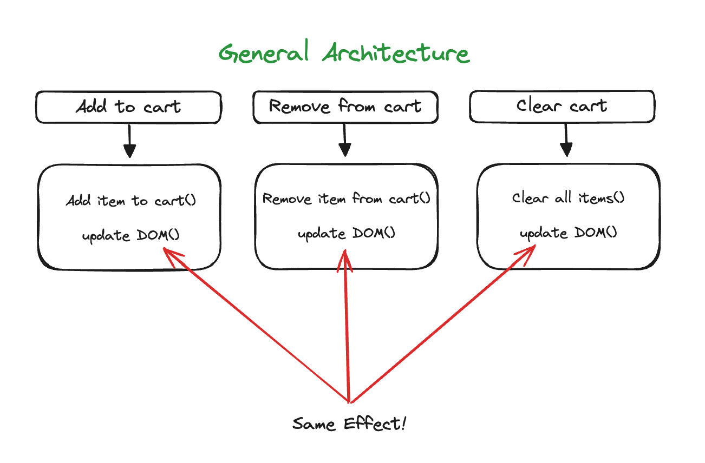
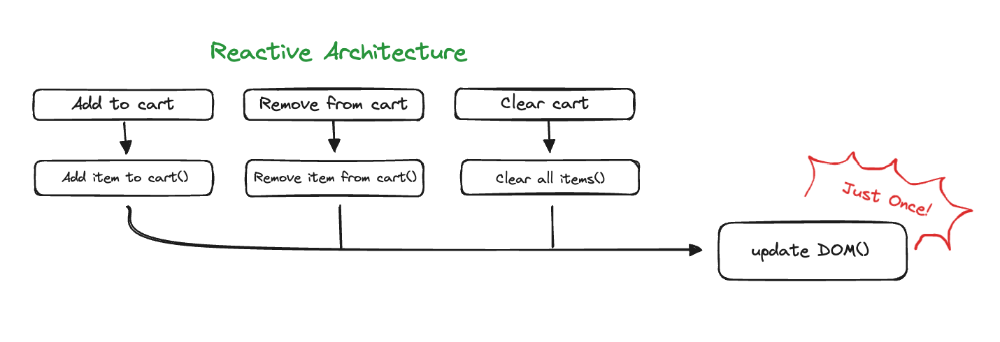

## 반응형 아키텍처

반응형 아키텍처는 코드에 나타난 순차적 액션의 순서를 뒤집는다.
효과(Effect)와 그 효과에 대한 원인을 분리해 코드에 복잡하게 꼬인 부분을 풀어낼 수 있다.

반응형 아키텍처는 애플리케이션을 구조화하는 방법이다.
핵심 원칙은 이벤트에 대한 반응으로 일어날 일을 지정하는 것이다.
따라서 웹 서비스와 UI 에 잘 어울리는 아키텍처라고 할 수 있다.
웹 서비스는 웹 요청 응답에 일어날 일을 지정하고, UI 는 버튼 클릭과 같은 이벤트 응답에 일어날 일을 지정하면 된다.

## 이벤트 핸들러

특정한 이벤트 응답에 일어날 일을 지정하고 정의하는 것을 **이벤트 핸들러**라고 부른다.
반응형 아키텍처에서는 하려고 하는 일만 처리하며, 모든 일은 특정한 이벤트가 발생했을 때의 응답으로 처리하게 된다.
원래 핸들러 함수에서 순서대로 실행되던 일들을 여러 개의 핸들러에서 실행되도록 나눌 수도 있다.

## 특징

#### 1. 원인과 효과가 결합한 것을 분리

이벤트 핸들러를 위해서는 **원인**과 **효과**를 분리하여야 한다.
어떤 경우에는 원인과 효과를 분리하면 코드가 읽기 어려워지지만, 코드가 더 유연해지고 하고자 하는 일을 명확하게 표현할 수 있다.

위 그림은 일반적인 아키텍처에서 장바구니를 업데이트하는 구조이다.
일반적인 아키텍처에서는 장바구니를 업데이트하는 모든 UI 이벤트 핸들러에 DOM 을 업데이트하는 같은 코드를 넣어주어야 한다.
장바구니를 업데이트하는 곳이 늘어나게 될수록, DOM 을 업데이트하는 코드는 모든 곳에 추가되어야 하는 것이다.
다시 말해, **"장바구니 업데이트 버튼 클릭" 이라는 원인**과 그로 인한 **"DOM 업데이트" 라는 효과**가 강하게 결합되어 있다.

반면 반응형 아키텍처를 사용한 위 그림을 보면 어떤 원인에 의해 장바구니가 변경되더라도 DOM 업데이트는 단 한번만 수행되는 것을 알 수 있다.
#### 2. 여러 단계를 파이프라인으로 처리

함수형 도구를 연결하여 액션과 계산을 조합할 수 있다.
함수형 도구는 간단한 함수이지만 복잡한 동작을 만들 수 있으며 재사용하기도 좋다.

반응형 아키텍처에서도 간단한 액션과 계산을 조합해 복잡한 동작을 만들 수 있다.
조합된 액션은 파이프라인과 같다.
데이터가 파이프라인으로 들어가 각 단계에서 처리되기 때문이다.
파이프라인은 작은 액션과 계산을 조합한 하나의 액션이다.

따라서 어떤 일이 발생하는 여러 단계가 있다면 파이프라인으로 처리하는 것이 좋다.
각 단계에서 생성된 데이터는 다음 단계의 입력값으로 사용된다.

#### 3. 유연한 타임라인

순서를 표현하는 방법을 뒤집으면 타임라인이 유연해진다.
이를 통해 타임라인을 작은 부분으로 분리하면서 짧은 타임라인을 만들 수 있다.

사실 타임라인이 많아지는 것은 좋지 않다.
하지만 타임라인이 많아도 문제가 없는 경우가 있는데, 바로 공유하는 자원이 없는 경우이다.

ValueCell 은 감시자를 호출할 때 현재 값을 넘겨주기 때문에 감시자 함수가 직접 전역변수와 같은 공유 자원에 접근할 필요가 없다.
마찬가지로, FormulaCell 도 감시자를 호출할 때 현재 값을 넘겨주기 때문에 직접 공유 자원에 접근할 필요가 없다.
결국 반응형 아키텍처로 인해 타임라인이 늘어나더라도, 서로 다른 자원을 사용하기 때문에 안전하다고 볼 수 있다.