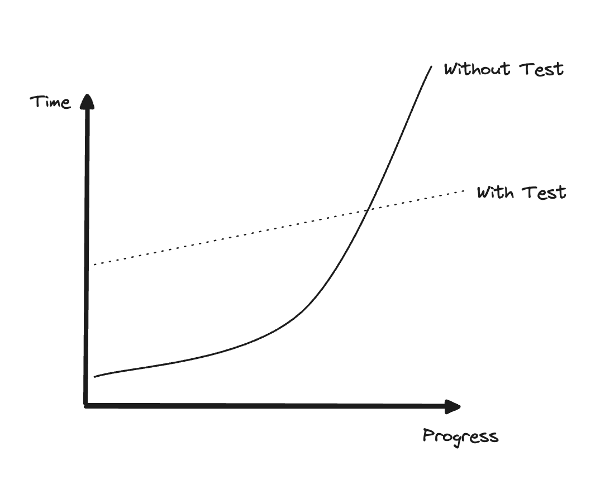

단위 테스트의 목표는 **소프트웨어 프로젝트의 지속 가능한 성장을 가능하게 하는 것**이다.
지속 가능하다는 것이 핵심이다. 단위 테스트를 통해 프로젝트가 상당히 쉽게 성장할 수 있다.
물론 시간이 지나면서 이렇게 계속 성장하기는 훨씬 어렵다.

실제로 프로젝트 초기에는 발목을 잡을 것이 없으므로 빠르게 시작할 수 있다.
아직 잘못된 아키텍처 결정이 없고, 걱정할 만한 코드가 있지도 않다.
그러나 시간이 지나면서 점점 더 많은 시간을 들여야 처음에 보여준 것과 같은 정도의 진척을 낼 수 있다.
결국 개발 속도가 현저히 느려지고, 심지어 전혀 진행하지 못할 정도로 느려질 수도 있다.

위 그래프는 테스트 유무에 따른 프로젝트 간 성장 추이의 차이를 나타낸 그래프인데, 실제로 테스트가 없는 프로젝트의 경우 시작은 유리하지만, 이내 진척이 없을 정도로 느려지는 것을 확인할 수 있다.

개발 속도가 빠르게 감소하는 이러한 현상을 **소프트웨어 엔트로피(Software entropy)** 라고도 부른다.
소프트웨어에서 엔트로피는 품질을 떨어뜨리는 코드 형태로 나타난다.
코드베이스에서 무언가를 변경할 때마다 무질서도(엔트로피)는 증가하는데, 지속적인 정리와 리팩터링 등과 같은 적절한 관리를 하지 않고 방치하면 시스템이 점점 더 복잡해지고 무질서해진다.
하나의 버그를 수정하면 더 많은 버그가 양산되고, 소프트웨어의 한 부분을 수정하면 다른 부분들이 고장 나게 되는 것이다.

테스트로 이러한 경향을 뒤집을 수 있다. 테스트는 안전망 역할을 하며, 대부분의 회귀에 대한 보험을 제공하는 도구라 할 수 있다.
테스트는 새로운 기능을 도입하거나 새로운 요구 사항에 더 잘 맞게 리팩터링한 후에도 기존 기능이 잘 작동하는지 확인하는 데 도움이 된다.

> 회귀는 특정 사건(일반적으로 코드 수정) 후에 기능이 의도한 대로 작동하지 않는 경우다. 소프트웨어 버그와 회귀라는 용어는 동의어이며 바꿔서 사용할 수 있다.

여기서 테스트의 한 가지 단점을 생각해볼 수 있는데, 이러한 테스트는 초반에 노력이 필요하다는 것이다.
그러나 프로젝트 후반에도 잘 성장할 수 있도록 하므로 장기적으로 보면 그 비용을 메울 수 있다.
코드베이스를 지속적으로 검증하는 테스트 없이는 소프트웨어 개발이 쉽게 확장되지 않는다.

**지속성과 확장성**이 핵심이며, 이를 통해 장기적으로 개발 속도를 유지할 수 있다.

### 좋은 테스트와 좋지 않은 테스트를 가르는 요인

단위 테스트가 프로젝트 성장에 도움이 되는 것은 맞지만, 테스트를 작성하는 것만으로는 충분하지 않다.
잘못 작성한 테스트는 여전히 같은 결과를 낳는다.
물론, 초반에 코드가 나빠지는 것을 늦출 수는 있겠지만(테스트가 전혀 없는 상황에 비해 개발속도가 덜 느려지겠지만) 거시적으로 봤을 때는 큰 차이가 없다.

모든 테스트를 작성할 필요는 없다.
일부 테스트는 아주 중요하고 소프트웨어 품질에 매우 많은 기여를 하지만 그 밖에 다른 테스틑 그렇지 않다.
잘못된 경고가 발생하고, 회귀 오류를 알아내는 데 도움이 되지 않으며, 유지 보수가 어렵고 느리다.
프로젝트에 도움이 되는지 여부를 명확하게 파악하지 않고 단위 테스트를 작성하는 데만 빠져들기 쉽다.
다시 말해, 프로젝트에서 테스트를 많이 작성한다고 하더라도 그것만으로는 단위 테스트의 목표를 달성할 수 없는 것이다.

결국 **테스트의 가치와 유지 비용**을 모두 고려해야 한다.

비용은 다양한 요소들에 따라 결정된다.
- 기반 코드를 리팩터링할 때 테스트도 리팩터링하라.
- 각 코드 변경 시 테스트를 실행하라.
- 테스트가 잘못된 경고를 발생시킬 경우 처리하라.
- 기반 코드가 어떻게 동작하는지 이해해야 할 때는 테스트를 읽는 데 시간을 투자하라.

지속 가능한 프로젝트 성장을 위해서는 고품질 테스트에만 집중해야 한다.
고품질 테스트만이 테스트 스위트(Test suite)에 남을 만한 테스트 유형이다.

### 제품 코드 대 테스트 코드

사람들은 종종 제품 코드와 테스트 코드가 다르다고 생각한다.
- 테스트는 제품 코드에 추가된 것이다.
- 테스트는 소유 비용이 없다.
- 테스트가 많으면 많을수록 좋다.

하지만 그렇지 않다.
코드는 자산이 아니라 책임이다. 코드가 더 많아질수록, 소프트웨어 내의 잠재적인 버그에 노출되는 표면적이 더 넓어지고 프로젝트 유지비가 증가한다.
따라서 가능한 한 적은 코드로 문제를 해결하는 것이 좋다.

테스트도 역시 코드다.
특정 문제를 해결하는 것, 즉 애플리케이션의 정확성을 보장하는 것을 목표로 하는 코드베이스의 일부로 봐야 한다.
다른 코드와 마찬가지로 단위 테스트도 버그에 취약하고 유지보수가 필요하다.