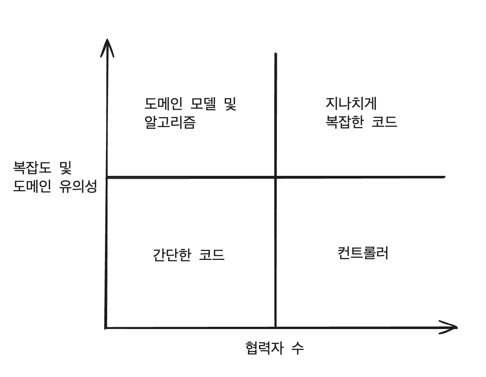

테스트 코드와 제품 코드는 본질적으로 관련되어 있기 때문에 기반 코드를 리팩터링하지 않고서는 테스트 스위트를 크게 개선할 수 없다.

### 코드의 네 가지 유형

모든 제품 코드는 2차원으로 분류할 수 있다.
- **복잡도 또는 도메인 유의성**
- **협력자 수**

**코드 복잡도**는 코드 내 의사 결정(분기) 지점 수로 정의한다. 숫자가 클수록 복잡도는 더 높아진다.
**도메인 유의성**은 코드가 프로젝트의 문제 도메인에 대해 얼마나 의미있는지를 나타낸다.
일반적으로 도메인 계층의 모든 코드는 최종 사용자의 목표와 직접적인 연관성이 있으므로 도메인 유의성이 높다.
복잡한 코드와 도메인 유의성을 갖는 코드가 단위 테스트에서 가장 이롭다.

**협력자**는 가변 의존성이거나 프로세스 외부 의존성이다. 협력자가 많은 코드는 테스트 비용이 많이 든다. 협력자를 예상되는 조건으로 두고 상태나 상호 작용을 확인하게끔 코드를 작성해야 한다. 협력자가 많을수록 테스트도 커진다.
**협력자의 유형**도 중요하다. 도메인 모델이라면 프로세스 외부 협력자를 사용하면 안된다. 테스트에서 목 체계가 복잡하기 때문에 유지비가 더 들기 때문이다.
같은 맥락에서, 리팩터링 내성을 지키기 위해서는 신중하게 목을 사용해야 하는데, 애플리케이션 경계를 넘는 상호 작용을 검증하는 데만 사용해야 한다. 이를 위해 프로세스 외부 의존성을 가진 모든 통신은 도메인 계층 외부의 클래스에 위임하는 것이 좋다.
**암시적 협력자**와 **명시적 협력자** 모두 이 숫자에 해당한다.

이렇게 코드 복잡도, 도메인 유의성, 협력자 수의 조합으로 네 가지 코드 유형을 볼 수 있다.

1. 도메인 모델과 알고리즘
	- 복잡한 코드는 보통 도메인 모델이지만, 때로 도메인과 관련이 없는 복잡한 알고리즘이 있을 수 있다.
2. 간단한 코드
	- 협력자가 있는 경우가 거의 없고 복잡도나 도메인 유의성이 거의 없다.
3. 컨트롤러
	- 이 코드는 복잡하거나 비즈니스에 중요한 작업을 하는 것이 아니라 도메인 클래스와 외부 애플리케이션 같은 다른 구성 요소의 작업을 조정한다.
4. 지나치게 복잡한 코드
	- 협력자가 많으며 복잡하거나 중요하다. **두 가지 지표**가 모두 높다.

좌측 상단 사분면(도메인 모델 및 알고리즘)을 단위 테스트하면 노력 대비 가장 이롭다. 이는 단위 테스트가 매우 가치 있고 저렴하다는 의미이다.
간단한 코드는 테스트 가치가 0에 가깝다. 따라서 테스트할 필요가 전혀 없다.
컨트롤러의 경우, 포괄적인 통합 테스트의 일부로서 간단히 테스트해야 한다.

가장 문제가 되는 코드 유형은 지나치게 복잡한 코드다.
단위 테스트가 어렵겠지만, 테스트 커버리지 없이 내버려두는 것은 너무 위험하다.
보통 이러한 유형은 알고리즘과 컨트롤러라는 두 부분으로 나누는 것이 일반적이다.
지나치게 복잡한 코드를 피하고 도메인 모델과 알고리즘만 단위 테스트하는 것이 매우 가치 있고 유지 보수가 쉬운 테스트 스위트로 가는 길이기 때문이다.

물론 지나치게 복잡한 코드를 알고리즘과 컨트롤러로 나누어 제거하는 것은 쉬운 일이 아니다.
따라서 이를 위해 참고할만한 기법이 있다.

### 험블 객체 패턴을 사용해 지나치게 복잡한 코드 분할하기

지나치게 복잡한 코드를 쪼개려면, 험블 객체 패턴(Humble Object Pattern)을 사용해야 한다.

어려운 의존성과 결합된 코드는 테스트하기 어렵다. 테스트가 해당 의존성도 다뤄야 하기 때문에 유지비가 증가하기 때문이다.
이러한 코드를 테스트하려면, 테스트가 가능한 부분을 추출해야 한다. 결과적으로 코드는 테스트 가능한 부분을 둘러싼 얇은 험블 래퍼(Humble Wrapper)가 된다. 이 험블 래퍼가 테스트하기 어려운 의존성과 새로 추출된 구성 요소를 붙이지만, 자체적인 로직이 거의 없거나 전혀 없으므로 테스트할 필요가 없다.

> 험블 객체 패턴은 지나치게 복잡한 코드에서 로직을 추출해 코드를 테스트할 필요가 없도록 간단하게 만든다.
> 추출된 로직은 테스트하기 어려운 의존성에서 분리된 다른 클래스로 이동한다.
> 분리된 다른 클래스의 로직만을 테스트한다.

육각형 아키텍처와 함수형 아키텍처 모두 정확히 이 패턴을 구현한다.
육각형 아키텍처는 비즈니스 로직과 프로세스 외부 의존성과의 통신을 분리한다.
함수형 아키텍처는 프로세스 외부 의존성 뿐 아니라 모든 협력자와의 커뮤니케이션에서 비즈니스 로직을 분리한다.
즉, 함수형 코어에는 아무런 협력자도 없으며 함수형 코어의 모든 의존성은 불변이기 때문에 협력자의 수가 사실 상 0 에 수렴한다.

험블 객체 패턴을 보는 또 다른 방법은 단일 책임 원칙(Single Responsibility Principle)을 지키는 것이다.
이는 각 클래스가 단일한 책임만 가져야 한다는 원칙이다.
그러한 책임 중 하나로 늘 비즈니스 로직이 있는데, 이 패턴을 적용하면 비즈니스 로직을 거의 모든 것과 분리할 수 있다.

> 코드의 깊이와 너비
> 코드가 깊거나(복잡하거나 중요함) 넓을(많은 협력자와 작동함) 수 있지만, 둘 다 가능하지는 않다.
> 예를 들어, 컨트롤러는 많은 의존성을 조정하지만, 그 자체로 복잡하지 않다. 반면 도메인 클래스는 그 반대다.

요약하면, 비즈니스 로직과 오케스트레이션을 지속적으로 분리하려고 시도해야 하는 이유는 테스트 용이성이 좋아지는 것 뿐 아니라, 코드 복잡도를 해결할 수 있기 때문이다. 이는 결과적으로 프로젝트 성장에 중요한 역할을 한다.